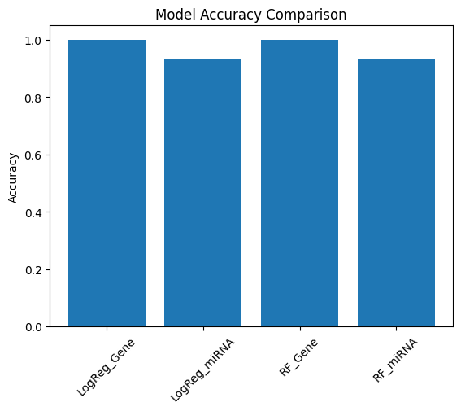
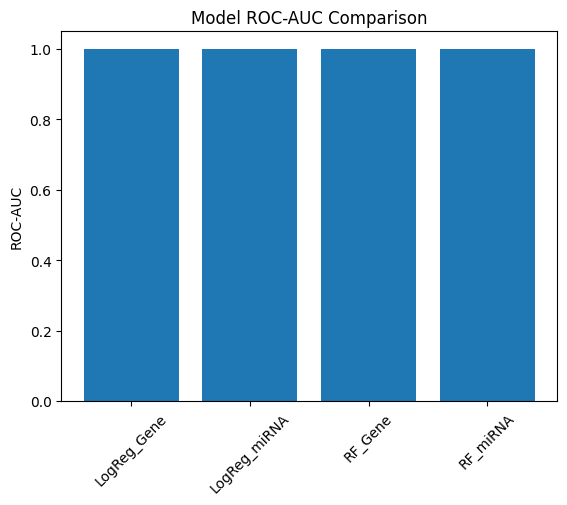
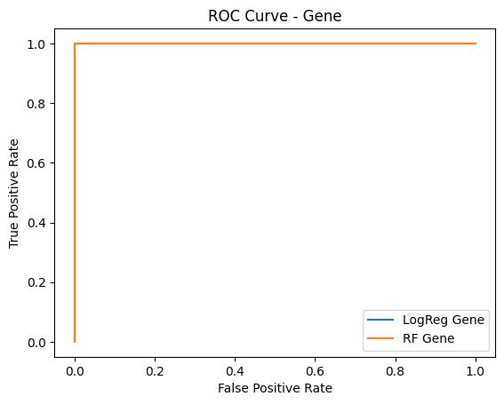
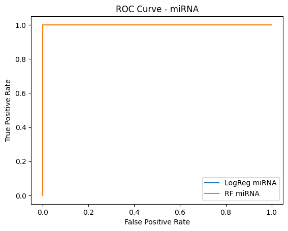
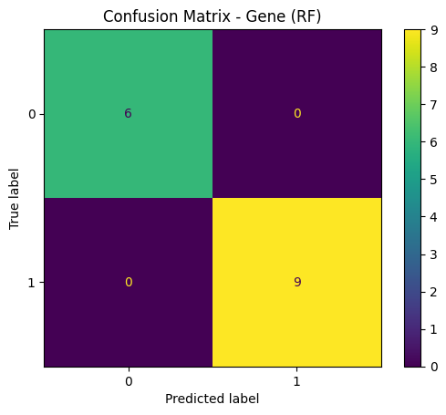
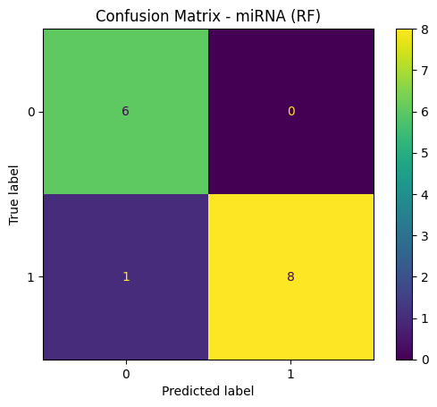

# Gene Expression vs miRNA Classification (GSE53482)

This project compares the predictive power of gene expression and miRNA data for classifying Primary Myelofibrosis (PMF) vs control samples using machine learning models.

---

## Dataset

- **Source**: GEO (GSE53482)
- **Platforms**:
  - Gene Expression: GPL13667
  - miRNA Expression: GPL14613

Both datasets contain molecular profiles derived from the same patient cohort, enabling a direct comparison between gene and miRNA-based models.

---

## Problem Definition

Binary classification task:

- **PMF (Primary Myelofibrosis)** → Label 1  
- **Control (PB CTR, BM CTR)** → Label 0  

---

## Project Structure

```text
├── Data/
│ ├── Raw/ # GEO series matrix files
│ └── Processed/ # Cleaned and aligned datasets
│
├── Results/
│ ├── Plots/ # Saved visualizations
│ └── *.csv # Model results and predictions
│
├── Notebooks/
│ ├── 01_data_loading.ipynb
│ ├── 02_metadata_processing.ipynb
│ ├── 03_model_training.ipynb
│ └── 04_model_evaluation.ipynb
│
├── Src/
│ └── Data_Preprocessing.py
│
└── README.md
```

---

## Pipeline Overview

### 1. Data Loading & Cleaning
- Load GEO series matrix files
- Extract expression tables
- Clean and transform data into ML-ready format

### 2. Metadata Processing
- Extract sample metadata
- Parse structured variables
- Construct classification labels
- Align metadata with expression datasets

### 3. Model Training
- Train-test split (stratified)
- Feature scaling
- Models:
  - Logistic Regression
  - Random Forest

### 4. Evaluation
- Accuracy and ROC-AUC comparison
- ROC curve visualization
- Confusion matrices

---

## Methods

### Preprocessing
- Removal of formatting artifacts (quotes)
- Conversion to numeric values
- Transposition (samples × features)

### Models
- Logistic Regression
- Random Forest Classifier

### Metrics
- Accuracy
- ROC-AUC
- Confusion Matrix
- ROC Curve

---

##  Visualizations

### Model Accuracy Comparison


### Model ROC-AUC Comparison


### ROC Curve (Gene)


### ROC Curve (miRNA)


### Confusion Matrix (Gene - RF)


### Confusion Matrix (miRNA - RF)


---

## ▶️ How to Run

### 1. Clone the repository
```bash
git clone <https://github.com/Anitej1824/PMF_GEX-miREX_ML_Comparison>
cd <PMF_GEX-miREX_ML_Comparison>
