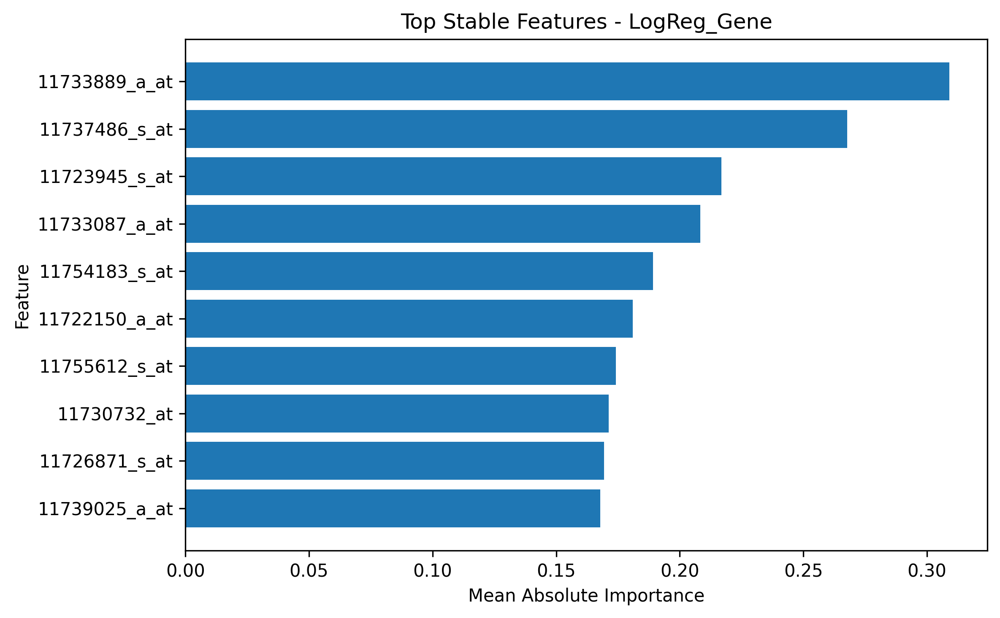
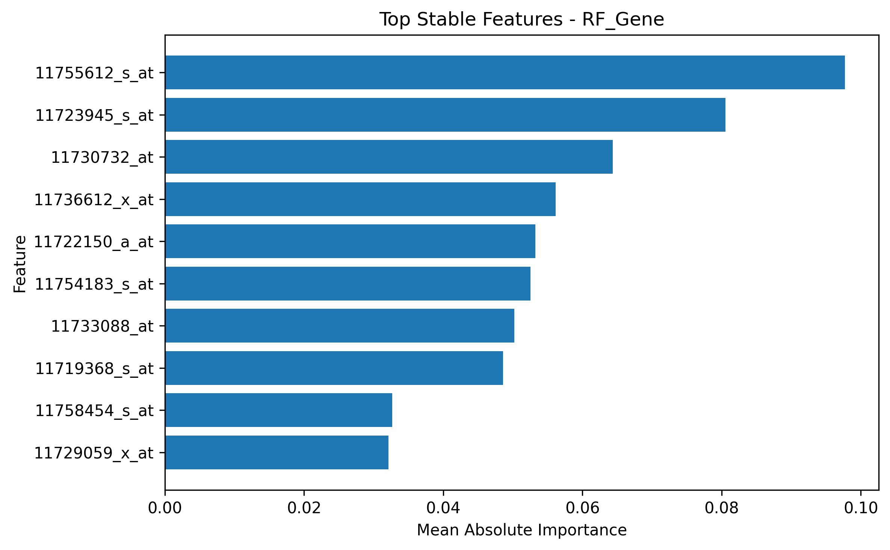
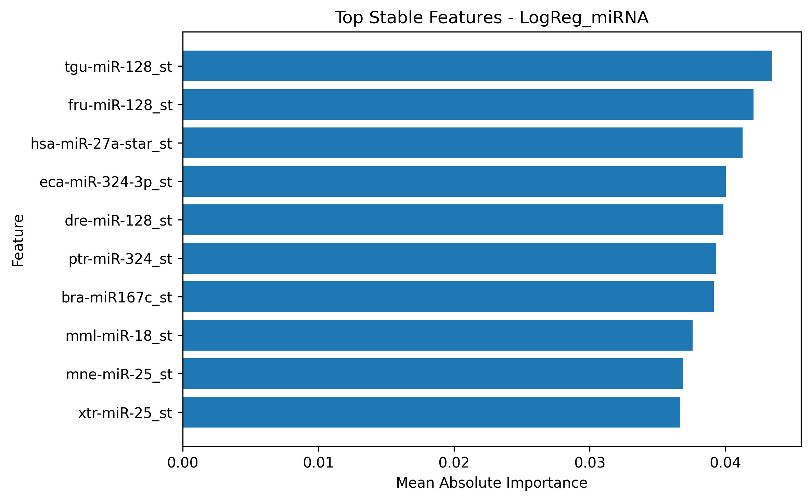
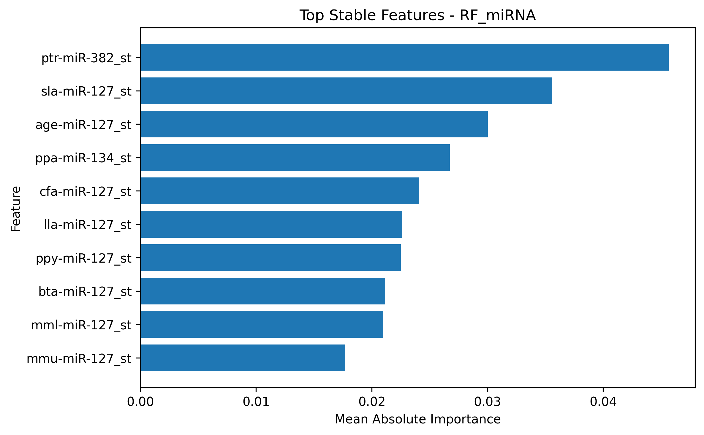

# PMF Molecular Classification

A reproducible machine-learning workflow for classifying **Primary Myelofibrosis (PMF)** versus control samples using high-dimensional gene-expression and miRNA-expression data.

The project uses the GEO dataset **GSE53482** as a practical bioinformatics and machine-learning playground. The primary goal is not biological discovery, biomarker validation, or mechanistic interpretation, but to develop and evaluate a complete machine-learning workflow for molecular data while applying appropriate practices for small-sample, high-dimensional datasets.

The project focuses on **data preprocessing, metadata construction, leakage-aware feature selection, cross-validation, model comparison, out-of-fold evaluation, and model interpretation**.

---

## Features

* GEO series-matrix metadata extraction and parsing
* Gene-expression and miRNA-expression preprocessing
* Sample-level metadata validation and alignment
* Construction of binary PMF/control classification labels
* Diagnostic assessment of potential biological and technical confounding
* High-dimensional feature selection using `SelectKBest`
* Feature selection performed within cross-validation pipelines
* Stratified 5-fold cross-validation
* Logistic Regression classification
* Random Forest classification
* Model comparison across multiple feature-set sizes
* Out-of-fold probability and class predictions
* ROC-AUC and classification metric evaluation
* ROC curve visualization
* Confusion matrix visualization
* Fold-level feature-importance extraction
* Feature-selection stability analysis
* Comparison of feature stability between modelling approaches
* Reproducible results and visualization outputs

---

## Analysis Overview

The project follows a five-stage analysis workflow:

```text
GEO Series Matrix Files
          │
          ▼
01 - Expression Preprocessing
          │
          ▼
Cleaned Gene / miRNA Expression
          │
          ▼
02 - Metadata Processing
          │
          ├── Sample metadata extraction
          ├── PMF / Control labels
          ├── Confounding diagnostics
          └── Sample alignment
          │
          ▼
Aligned Expression + Metadata
          │
          ▼
03 - Model Training & Comparison
          │
          ├── Stratified 5-fold CV
          ├── Fold-level feature selection
          ├── Logistic Regression
          └── Random Forest
          │
          ├───────────────┐
          ▼               ▼
04 - Model Evaluation   05 - Model Interpretation
          │               │
          ├── ROC curves  ├── Feature stability
          ├── Confusion   ├── Importance
          │   matrices    └── Model agreement
          │
          └───────────────┬───────────────
                          ▼
                 Reproducible Results
```

---

## Project Structure

```text
PMF-Molecular-Classification/
│
├── Data/
│   ├── Raw/                              # Original GEO series matrix files
│   └── Processed/                        # Cleaned and aligned expression data
│
├── Results/
│   ├── Tables/
│   │   ├── Cross_Validation/
│   │   │   └── Cross_Validation_Results.csv
│   │   │
│   │   ├── OOF_Predictions/
│   │   │   ├── LogReg_Gene_oof_predictions.csv
│   │   │   ├── RF_Gene_oof_predictions.csv
│   │   │   ├── LogReg_miRNA_oof_predictions.csv
│   │   │   └── RF_miRNA_oof_predictions.csv
│   │   │
│   │   └── Feature_Importance/
│   │       └── Feature_Importance_By_Fold.csv
│   │
│   └── Plots/
│       ├── cross_validation_roc_auc.png
│       ├── roc_curves_oof.png
│       ├── confusion_matrix_LogReg_Gene.png
│       ├── confusion_matrix_LogReg_miRNA.png
│       ├── top_features_LogReg_Gene.png
│       ├── top_features_RF_Gene.png
│       ├── top_features_LogReg_miRNA.png
│       └── top_features_RF_miRNA.png
│
├── Src/
│   ├── __init__.py
│   ├── Data_Preprocessing.py
│   └── Model_Utility.py
│
├── Notebooks/
│   ├── 01 - Data Loading
│   ├── 02 - Metadata Processing & Label Construction
│   ├── 03 - Model Training & Comparison
│   ├── 04 - Model Evaluation & Visualization
│   └── 05 - Model Interpretation
│
├── .gitignore
├── README.md
└── environment.yaml
```

---

## Study Context

This project uses **GSE53482**, a GEO dataset containing molecular measurements from samples associated with Primary Myelofibrosis (PMF) and control groups.

Two molecular data types are analysed:

* Gene expression
* miRNA expression

The classification task is defined as:

```text
PMF      → 1
Control  → 0
```

The dataset contains **73 samples**, consisting of:

* 42 PMF samples
* 31 control samples

The gene-expression dataset contains **49,386 features**, while the miRNA dataset contains **20,212 features**.

This produces a highly dimensional setting in which the number of molecular features is substantially larger than the number of available samples.

**Dataset:** [GSE53482](https://www.ncbi.nlm.nih.gov/geo/query/acc.cgi?acc=GSE53482)

---

## Project Goal

The goal of this project is to practice and demonstrate a complete machine-learning workflow for high-dimensional molecular data.

Rather than attempting to reproduce a biological discovery or identify clinically validated biomarkers, the project focuses on computational methodology.

The main questions are:

1. Can molecular expression profiles distinguish PMF samples from controls within this cohort?
2. How do Logistic Regression and Random Forest compare?
3. How does model performance change with the number of selected features?
4. Can feature selection be performed without information leakage?
5. Which features are selected consistently across cross-validation folds?
6. Do different modelling approaches identify overlapping predictive features?

The resulting project is therefore intended as a **machine-learning and bioinformatics portfolio exercise**, using a real molecular dataset rather than a synthetic dataset.

---

## Input Data

The analysis uses the original GEO series matrix files corresponding to the two molecular platforms.

### Gene Expression

```text
Data/Raw/GSE53482-GPL13667_series_matrix.txt.gz
```

The gene-expression matrix contains 73 samples and 49,386 processed molecular features.

### miRNA Expression

```text
Data/Raw/GSE53482-GPL14613_series_matrix.txt.gz
```

The miRNA matrix contains 73 samples and 20,212 processed molecular features.

The raw GEO metadata is extracted directly from the corresponding series matrix files rather than relying on manually constructed sample labels.

---

## Notebook 01 — Expression Data Preprocessing

The first notebook prepares the molecular expression datasets for downstream analysis.

The preprocessing stage produces cleaned gene-expression and miRNA-expression matrices that can be used consistently throughout the modelling workflow.

The processed datasets are saved under:

```text
Data/Processed/
```

The notebook establishes the feature matrices used by the subsequent metadata and machine-learning stages.

---

## Notebook 02 — Metadata Processing & Label Construction

The second notebook extracts sample-level metadata from the original GEO files.

Metadata is parsed into a structured table containing variables such as:

* Supplier
* Cell type
* Disease
* JAK2 V617F status
* Tissue

The disease categories are converted into a binary classification target:

```text
PMF      → 1
PB CTR   → 0
BM CTR   → 0
```

The resulting class distribution is:

```text
PMF       42
Control   31
```

### Confounding Diagnostics

Potential biological and technical confounders are examined using cross-tabulations against the binary classification label.

The analysis examines:

* Supplier
* Cell type
* JAK2 V617F status
* Tissue

These checks are **diagnostic only**. Samples are not removed or modified based on these observations.

The diagnostics demonstrate that some metadata variables are strongly associated with the classification label. For example, cell type and tissue are not evenly distributed between PMF and control samples.

This is an important limitation of the dataset because a classifier may exploit group-associated experimental characteristics in addition to disease-associated molecular differences.

The project therefore treats these analyses as a modelling limitation rather than attempting to correct the imbalance through arbitrary sample removal.

---

## Notebook 03 — Model Training & Comparison

The third notebook performs model development and cross-validation.

Because the dataset contains far more features than samples, dimensionality reduction through supervised feature selection is incorporated into the modelling pipeline.

### Models

Two classifiers are compared:

**Logistic Regression**

A linear classifier providing a relatively interpretable baseline for high-dimensional expression data.

**Random Forest**

A nonlinear ensemble classifier capable of modelling interactions and nonlinear relationships between selected features.

### Cross-Validation

Model performance is evaluated using:

```text
Stratified 5-fold cross-validation
```

The stratification preserves the PMF/control class ratio across folds.

A fixed random seed of `42` is used to make the cross-validation splits reproducible.

### Leakage-Aware Feature Selection

Feature selection is performed inside the scikit-learn pipeline.

Candidate feature-set sizes are:

```text
10
25
50
100
250
500
1000
```

For each cross-validation fold, feature ranking is calculated using only the training portion of that fold.

This prevents the validation samples from influencing feature selection.

This is particularly important in this project because the number of molecular features is much larger than the number of samples.

### Feature-Set Selection

The preferred feature count is selected independently for each dataset/model combination.

Candidate feature counts are considered practically equivalent when they fall within:

```text
ROC-AUC tolerance = 0.01
F1 tolerance      = 0.01
```

Among equivalent candidates, the smallest feature set is preferred.

The selected feature counts are:

| Dataset | Model               | Selected features |
| ------- | ------------------- | ----------------: |
| Gene    | Logistic Regression |                50 |
| Gene    | Random Forest       |                25 |
| miRNA   | Logistic Regression |              1000 |
| miRNA   | Random Forest       |               250 |

---

## Cross-Validation Results

The final selected pipelines produced the following cross-validation performance:

| Dataset | Model               | ROC-AUC | Accuracy | Precision | Recall |    F1 | Features |
| ------- | ------------------- | ------: | -------: | --------: | -----: | ----: | -------: |
| Gene    | Logistic Regression |   1.000 |    1.000 |     1.000 |  1.000 | 1.000 |       50 |
| Gene    | Random Forest       |   1.000 |    1.000 |     1.000 |  1.000 | 1.000 |       25 |
| miRNA   | Logistic Regression |   1.000 |    1.000 |     1.000 |  1.000 | 1.000 |     1000 |
| miRNA   | Random Forest       |   0.985 |    0.919 |     0.953 |  0.908 | 0.929 |      250 |

The gene-expression models achieved perfect cross-validation performance within the available cohort.

The miRNA Logistic Regression model also achieved perfect mean performance under the selected feature configuration, while the miRNA Random Forest model showed lower performance and greater fold-to-fold variability.

These results demonstrate strong predictive separation within the dataset, but they should not be interpreted as evidence of clinical performance or external generalizability.

---

## Notebook 04 — Model Evaluation & Visualization

The fourth notebook evaluates the models using the out-of-fold predictions generated during Notebook 03.

Out-of-fold predictions are important because each sample receives a prediction from a model that was not trained on that sample.

This provides a consistent basis for visual evaluation.

### ROC Curves

ROC curves are generated from the out-of-fold predicted probabilities for all four model/dataset combinations.

The resulting visualization compares the ability of each model to discriminate between PMF and control samples.

<p align="center">
  
</p>

### Cross-Validation ROC-AUC

The mean ROC-AUC and fold-level standard deviation are visualized for each model.

<p align="center">
  
</p>

### Confusion Matrices

Confusion matrices are generated from out-of-fold predictions for the Logistic Regression models.

<p align="center">
  
  
</p>

These visualizations provide complementary views of model discrimination and classification behaviour.

---

## Notebook 05 — Model Interpretation

The fifth notebook examines the stability and contribution of features used by the final models.

Rather than interpreting a single fitted model, feature information recorded across the five cross-validation folds is used.

Two complementary quantities are considered:

* **Selection frequency** — how often a feature was selected across the five folds
* **Model importance** — the magnitude of the feature's contribution when selected

A feature selected in at least four of the five folds is considered a **stable feature** for the purposes of this analysis.

### Logistic Regression

For Logistic Regression, the signed coefficient is retained to preserve its direction, while the absolute coefficient magnitude is used to rank feature importance.

### Random Forest

For Random Forest, the model-provided non-negative feature importance is used directly.

### Feature Stability

The analysis identifies features that are repeatedly selected across different training subsets.

The top stable features are visualized separately for each dataset and model.

<p align="center">
  
  
</p>

<p align="center">
  
  
</p>

Agreement between Logistic Regression and Random Forest is also examined by identifying features that are considered stable by both approaches.

This analysis is intended to assess **model-level feature stability**, not biological significance.

The identified features should therefore be interpreted as predictors used by the models rather than validated biomarkers or mechanistically important molecular features.

---

## Key Results

The complete workflow produced several notable modelling observations.

### Dataset

The analysis used:

```text
73 samples
42 PMF
31 Control
```

with:

```text
49,386 gene-expression features
20,212 miRNA features
```

### Model Performance

Gene-expression models achieved perfect cross-validation performance under the selected feature configurations.

miRNA Logistic Regression also achieved perfect mean performance, while miRNA Random Forest produced a lower mean ROC-AUC of approximately `0.985` and F1 score of approximately `0.929`.

### Feature Selection

The selected feature counts differed between models:

```text
Gene + Logistic Regression → 50
Gene + Random Forest       → 25

miRNA + Logistic Regression → 1000
miRNA + Random Forest       → 250
```

This reflects differences in the predictive structure of the two molecular datasets and the behaviour of the two modelling approaches.

### Feature Stability

Feature importance was recorded independently within each cross-validation fold.

Features repeatedly selected across folds were used to identify stable predictors and compare feature agreement between Logistic Regression and Random Forest.

This provides a more robust model-level interpretation than ranking features from a single fitted model.

---

## Important Limitations

The strong cross-validation results should be interpreted cautiously.

### Small Sample Size

The analysis contains only 73 samples.

Although stratified cross-validation provides a more efficient estimate than a single train/test split, performance estimates can still be sensitive to the particular samples available.

### High-Dimensional Feature Space

The number of molecular features greatly exceeds the number of samples.

This creates a high risk of overfitting and makes feature selection an essential part of the modelling workflow.

### Potential Confounding

Several sample characteristics are strongly associated with the PMF/control label.

In particular, tissue and cell type show substantial group imbalance.

Consequently, molecular classifiers may capture differences associated with sample composition or experimental characteristics rather than disease status alone.

### No Independent Validation Cohort

The models are evaluated only within the available GSE53482 cohort.

There is no independent external cohort in this project.

Therefore, the observed performance should be interpreted as **within-cohort predictive performance**, not as evidence of clinical generalizability.

### No Biological Interpretation

The project intentionally does not perform:

* Pathway analysis
* Gene ontology analysis
* Functional enrichment
* Biomarker validation
* Mechanistic interpretation
* Literature-based validation of selected features

The identified features are treated strictly as **model predictors**.

---

## Outputs

### Cross-Validation Results

```text
Results/Tables/Cross_Validation/Cross_Validation_Results.csv
```

Contains the final cross-validation performance for all dataset/model combinations, including:

* ROC-AUC
* ROC-AUC standard deviation
* Accuracy
* Accuracy standard deviation
* Precision
* Recall
* F1 score
* Selected feature count

### Out-of-Fold Predictions

```text
Results/Tables/OOF_Predictions/
```

Contains out-of-fold predictions for:

* Logistic Regression — Gene
* Random Forest — Gene
* Logistic Regression — miRNA
* Random Forest — miRNA

Each file contains:

```text
y_true
y_pred
y_prob
```

### Feature Importance

```text
Results/Tables/Feature_Importance/Feature_Importance_By_Fold.csv
```

Contains fold-level feature-selection and model-importance information.

This table supports the feature-stability analysis performed in Notebook 05.

### Figures

```text
Results/Plots/
```

Contains:

* `cross_validation_roc_auc.png`
* `roc_curves_oof.png`
* `confusion_matrix_LogReg_Gene.png`
* `confusion_matrix_LogReg_miRNA.png`
* `top_features_LogReg_Gene.png`
* `top_features_RF_Gene.png`
* `top_features_LogReg_miRNA.png`
* `top_features_RF_miRNA.png`

---

## Reproducibility

The project is organized so that the notebooks can be executed sequentially.

```text
01 → 02 → 03 → 04 → 05
```

Notebook 01 generates the processed expression matrices.

Notebook 02 extracts and aligns the sample metadata and classification labels.

Notebook 03 trains the models, performs cross-validation, selects feature-set sizes, generates out-of-fold predictions, and records fold-level feature importance.

Notebook 04 evaluates the resulting predictions and generates model-performance visualizations.

Notebook 05 analyses feature stability and model-level feature importance.

The Python environment should be created from the project environment specification:

```bash
conda env create -f environment.yaml
conda activate <environment-name>
```

The notebooks should then be executed in order.

---
