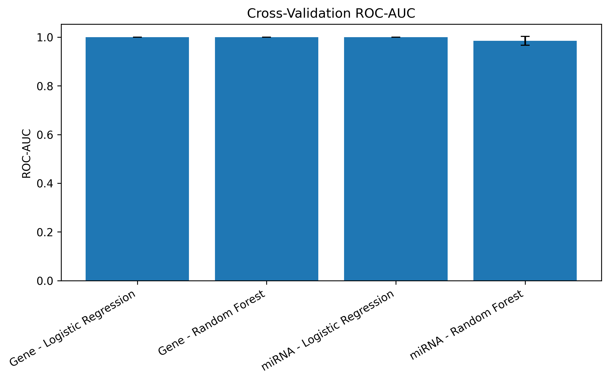
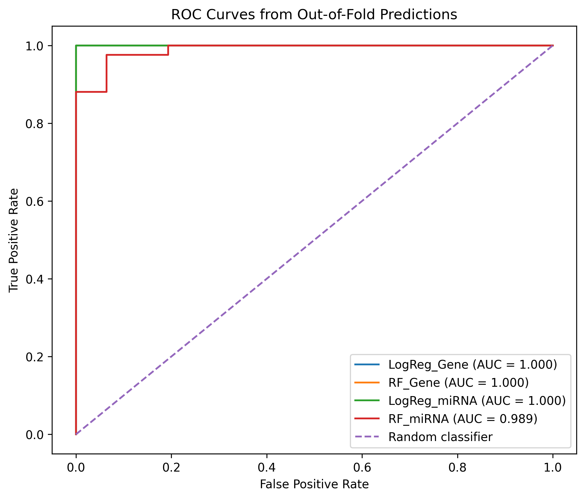
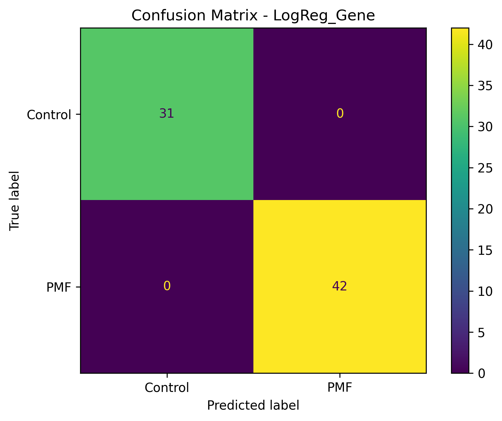
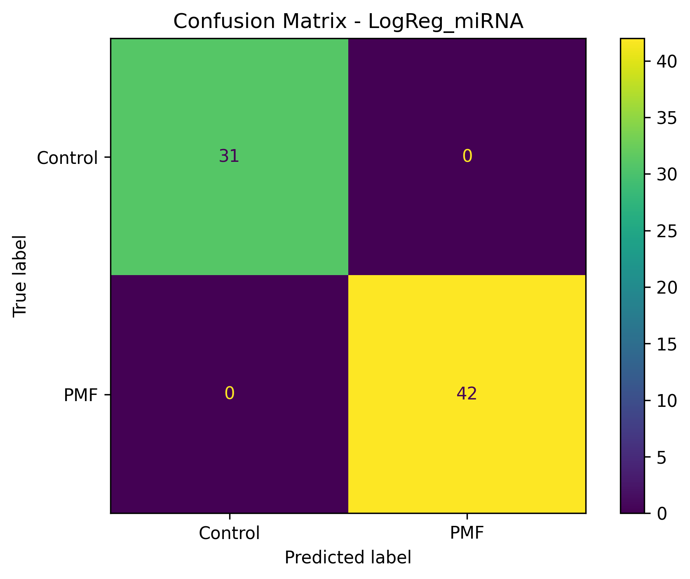

# PMF Molecular ML

A reproducible machine-learning workflow for classifying **Primary Myelofibrosis (PMF)** versus control samples using gene-expression and miRNA-expression data.

The project uses the public GEO dataset **GSE53482** as a practical bioinformatics machine-learning playground. It focuses on the computational challenges of applying supervised learning to high-dimensional molecular data, including metadata extraction, sample alignment, leakage-aware feature selection, cross-validation, model comparison, and out-of-fold evaluation.

This project is intended primarily as a **machine-learning and bioinformatics portfolio project** rather than a biological interpretation study. No attempt is made to identify disease mechanisms, propose biomarkers, or provide clinical conclusions.

---

## Features

* Processing of GEO gene-expression and miRNA-expression series matrix files
* Sample-level metadata extraction and parsing
* Construction of binary PMF/control classification labels
* Expression and metadata sample alignment validation
* Inspection of potential biological and technical confounding
* High-dimensional feature selection using `SelectKBest`
* Feature selection performed within cross-validation pipelines to prevent information leakage
* Stratified 5-fold cross-validation
* Logistic Regression classification
* Random Forest classification
* Comparison of multiple feature-set sizes
* Selection of parsimonious feature-set sizes based on model performance
* Fold-level feature-importance extraction
* Out-of-fold probability and class predictions
* ROC-AUC comparison
* ROC curve visualization
* Confusion matrix visualization
* Reproducible tabular model results
* Notebook-based analysis workflow

---

## Analysis Overview

The project follows this structure:

```text
GEO Series Matrix Files
        │
        ▼
Notebook 01
Data preprocessing
        │
        ├──────────────────────┐
        │                      │
        ▼                      ▼
Gene expression           miRNA expression
        │                      │
        └──────────┬───────────┘
                   │
                   ▼
Notebook 02
Metadata processing
& label construction
                   │
                   ▼
Aligned expression
+ PMF/control labels
                   │
                   ▼
Notebook 03
Model training
& comparison
                   │
          ┌────────┴────────┐
          ▼                 ▼
     Logistic           Random
     Regression          Forest
          │                 │
          └────────┬────────┘
                   ▼
        Cross-validation
        & feature selection
                   │
                   ▼
          Out-of-fold
           predictions
                   │
                   ▼
Notebook 04
Model evaluation
& visualization
                   │
          ┌────────┴────────┐
          ▼                 ▼
       ROC curves       Confusion
                         matrices
```

The notebooks separate **data preparation**, **metadata construction**, **model development**, and **model evaluation** so that the analysis stages remain explicit and reproducible.

---

## Project Structure

```text
PMF-Molecular-ML/
├── Data/
│   ├── Raw/
│   │   ├── GSE53482-GPL13667_series_matrix.txt.gz
│   │   └── GSE53482-GPL14613_series_matrix.txt.gz
│   │
│   └── Processed/
│       ├── gene_expression.csv
│       ├── mirna_expression.csv
│       ├── gene_expression_aligned.csv
│       ├── mirna_expression_aligned.csv
│       ├── gene_metadata.csv
│       └── mirna_metadata.csv
│
├── Results/
│   ├── Tables/
│   │   ├── Cross_Validation/
│   │   │   └── Cross_Validation_Results.csv
│   │   │
│   │   ├── OOF_Predictions/
│   │   │   ├── LogReg_Gene_oof_predictions.csv
│   │   │   ├── RF_Gene_oof_predictions.csv
│   │   │   ├── LogReg_miRNA_oof_predictions.csv
│   │   │   └── RF_miRNA_oof_predictions.csv
│   │   │
│   │   └── Feature_Importance/
│   │       └── Feature_Importance_By_Fold.csv
│   │
│   └── Plots/
│       ├── cross_validation_roc_auc.png
│       ├── roc_curves_oof.png
│       ├── confusion_matrix_LogReg_Gene.png
│       └── confusion_matrix_LogReg_miRNA.png
│
├── Src/
│   ├── Data_Preprocessing.py
│   └── Model_Utility.py
│
├── Notebooks/
│   ├── 01_Data_Loading.ipynb
│   ├── 02_Metadata_Processing_&_Label_Construction.ipynb
│   ├── 03_Model_Training_&_Comparison.ipynb
│   ├── 04_Model_Evaluation_&_Visualization.ipynb
│   └── 05_Model_Interpretation.ipynb
│
├── .gitignore
├── README.md
└── environment.yml
```

---

## Study Context

This project uses the publicly available GEO dataset **GSE53482**.

The dataset contains molecular expression measurements from samples associated with **Primary Myelofibrosis (PMF)** and control groups. Two molecular data types are considered:

* Gene expression
* miRNA expression

The analysis treats the biological labels primarily as a supervised-learning target rather than attempting to reproduce the biological conclusions of the original study.

**Dataset:** [GSE53482](https://www.ncbi.nlm.nih.gov/geo/query/acc.cgi?acc=GSE53482)

---

## Project Goal

The main goal is to practice and demonstrate a complete machine-learning workflow using real high-dimensional bioinformatics data.

Rather than focusing on biological discovery, the project asks a computational question:

> **How well can standard supervised machine-learning models distinguish PMF samples from controls using gene-expression and miRNA-expression profiles?**

The project emphasizes the practical problems that arise when machine learning is applied to molecular datasets where:

* The number of features is much larger than the number of samples.
* Samples require careful metadata alignment.
* Feature selection can easily introduce information leakage.
* A single train/test split may provide an unstable estimate of performance.
* Different molecular data types may contain different amounts of predictive signal.

---

## Input Data

Two GEO series matrix files are used as the raw input.

### Gene Expression

```text
Data/Raw/GSE53482-GPL13667_series_matrix.txt.gz
```

This file contains the gene-expression measurements and associated GEO sample metadata.

### miRNA Expression

```text
Data/Raw/GSE53482-GPL14613_series_matrix.txt.gz
```

This file contains the miRNA-expression measurements and associated GEO sample metadata.

The raw files are processed separately because the gene-expression and miRNA platforms contain different molecular feature spaces.

---

## Metadata and Classification Labels

Sample metadata is extracted directly from the original GEO series matrix files.

The metadata contains information including:

* Supplier
* Cell type
* Disease
* JAK2 V617F status
* Tissue

The original disease categories are:

```text
PMF
PB CTR
BM CTR
```

For the machine-learning task, these are converted into a binary target:

```text
PMF      → 1
PB CTR   → 0
BM CTR   → 0
```

The resulting dataset contains:

* **42 PMF samples**
* **31 control samples**
* **73 samples total**

The same classification scheme is applied to both molecular data types.

---

## Potential Confounding

The metadata is inspected for characteristics that may be associated with the classification label.

The following variables are examined:

* Supplier
* Cell type
* JAK2 V617F status
* Tissue

These checks reveal substantial differences between PMF and control samples.

For example, the control samples are associated with the `CTR` cell type while PMF samples are associated with `MPD`. Tissue and JAK2 V617F status also show strongly uneven distributions between the two classes.

These observations are important because a classifier may learn **group-associated biological or technical differences** rather than a disease-specific signal.

No samples are removed or modified on the basis of these observations. The confounding analysis is treated as a diagnostic step and is explicitly retained as a limitation of the machine-learning experiment.

---

## Dataset Dimensions

The processed expression matrices are highly dimensional relative to the number of samples.

| Dataset          | Samples | Features |
| ---------------- | ------: | -------: |
| Gene expression  |      73 |   49,386 |
| miRNA expression |      73 |   20,212 |

This produces a classic high-dimensional, low-sample-size setting:

```text
Features  >>>>>>>>>>>>>>>>>>>>> Samples
```

Directly fitting complex models to the complete feature space would increase the risk of overfitting.

For this reason, supervised feature selection is incorporated into the modelling workflow.

---

## Feature Selection

Feature selection is performed using `SelectKBest` with an ANOVA F-test.

The following feature counts are evaluated:

```text
10
25
50
100
250
500
1000
```

The important methodological detail is that feature selection occurs **inside the scikit-learn pipeline**.

Conceptually, each cross-validation fold follows:

```text
Training fold
     │
     ▼
SelectKBest
     │
     ▼
Selected features
     │
     ▼
Classifier
     │
     ▼
Validation fold
```

The validation fold is therefore not used to calculate feature rankings.

This prevents the feature-selection step from leaking information from the validation data into the model.

---

## Machine-Learning Models

Two classifiers are evaluated.

### Logistic Regression

Logistic Regression provides a relatively simple linear baseline for high-dimensional expression data.

The model is combined with feature selection and scaling in a pipeline.

```text
SelectKBest
     │
     ▼
StandardScaler
     │
     ▼
Logistic Regression
```

### Random Forest

Random Forest provides a nonlinear ensemble model that can capture interactions between selected features.

The model uses the same leakage-aware feature-selection framework.

```text
SelectKBest
     │
     ▼
Random Forest
```

The two models provide complementary modelling approaches rather than assuming that one classifier is universally preferable.

---

## Cross-Validation Strategy

Because the dataset contains only 73 samples, a conventional single train/test split would produce a relatively small test set and potentially unstable performance estimates.

The models are therefore evaluated using:

**Stratified 5-fold cross-validation**

```python
StratifiedKFold(
    n_splits=5,
    shuffle=True,
    random_state=42
)
```

Stratification preserves the approximate PMF/control class ratio across the folds.

The same cross-validation strategy is used when evaluating different feature-set sizes and the final selected models.

---

## Feature-Set Selection

Feature-set size is selected independently for each combination of:

* Molecular data type
* Classifier

A candidate feature count is considered practically equivalent to the best-performing configuration when its:

```text
ROC-AUC
and
F1 score
```

are within `0.01` of the best observed values.

Among these candidates, the smallest feature set is preferred.

This provides a simple parsimony rule:

> If a substantially smaller feature set performs essentially as well as a larger one, prefer the smaller model.

The selected configurations were:

| Dataset | Model               | Selected Features |
| ------- | ------------------- | ----------------: |
| Gene    | Logistic Regression |                50 |
| Gene    | Random Forest       |                25 |
| miRNA   | Logistic Regression |             1,000 |
| miRNA   | Random Forest       |               250 |

---

## Model Performance

The final selected models produced the following cross-validation results:

| Dataset | Model               | ROC-AUC | Accuracy | Precision | Recall |    F1 |
| ------- | ------------------- | ------: | -------: | --------: | -----: | ----: |
| Gene    | Logistic Regression |   1.000 |    1.000 |     1.000 |  1.000 | 1.000 |
| Gene    | Random Forest       |   1.000 |    1.000 |     1.000 |  1.000 | 1.000 |
| miRNA   | Logistic Regression |   1.000 |    1.000 |     1.000 |  1.000 | 1.000 |
| miRNA   | Random Forest       |   0.985 |    0.919 |     0.953 |  0.908 | 0.929 |

These results indicate that the models can separate the PMF and control samples extremely well within this dataset.

However, the results should **not** be interpreted as evidence that these models would perform equally well on independent patient cohorts.

The combination of:

* only 73 samples,
* tens of thousands of molecular features,
* strong metadata differences between groups,
* supervised feature selection,
* and evaluation on a single public cohort

creates substantial limitations for claims of generalization.

---

## Model Evaluation

Notebook 04 evaluates the models using both aggregate cross-validation metrics and out-of-fold predictions.

### ROC-AUC Comparison

The cross-validation ROC-AUC values are summarized with their fold-level variability.

<p align="center">
  
</p>

### ROC Curves

ROC curves are generated using out-of-fold predictions.

Each sample therefore receives a prediction from a model that did not use that sample during training.

<p align="center">
  
</p>

### Confusion Matrices

Confusion matrices are generated from the out-of-fold classifications for the Logistic Regression models.

<p align="center">
  
  
</p>

---

## Out-of-Fold Predictions

Out-of-fold predictions are generated for all four final model configurations.

For every sample, the stored predictions include:

* True class
* Predicted class
* Predicted PMF probability

These predictions are generated using stratified cross-validation and are saved for downstream evaluation.

The resulting files are:

```text
Results/Tables/OOF_Predictions/
├── LogReg_Gene_oof_predictions.csv
├── RF_Gene_oof_predictions.csv
├── LogReg_miRNA_oof_predictions.csv
└── RF_miRNA_oof_predictions.csv
```

Using out-of-fold predictions ensures that downstream ROC curves and confusion matrices are based on held-out predictions rather than predictions from models trained on the same samples.

---

## Feature Importance

Feature importance is recorded independently for each cross-validation fold.

For Logistic Regression, the fitted model coefficients are recorded.

For Random Forest, the fitted feature importances are recorded.

The feature-selection step is also fitted independently within each fold, meaning that the recorded features represent the features actually selected during that fold's training process.

The resulting table is saved to:

```text
Results/Tables/Feature_Importance/Feature_Importance_By_Fold.csv
```

This allows feature selection and model importance to be examined as a modelling property without claiming that individual molecular features constitute validated biomarkers.

---

## Limitations

This project is intentionally a machine-learning exercise rather than a biological or clinical study.

Several limitations are therefore important.

### Small Sample Size

Only 73 samples are available.

Even with cross-validation, performance estimates from such a small cohort can have substantial uncertainty.

### High-Dimensional Feature Space

The number of molecular features is orders of magnitude larger than the number of samples.

Although feature selection is used, this remains a difficult modelling regime.

### Dataset-Specific Signal

The extremely high performance observed for several models may reflect characteristics specific to this dataset.

In particular, the strong association between disease labels and metadata variables such as cell type, tissue, and JAK2 V617F status indicates that the classification task contains substantial biological and experimental structure.

### No External Validation

The models are evaluated within the available GSE53482 cohort.

No independent external dataset is used to estimate generalization performance.

### No Biological Interpretation

The project deliberately does not perform:

* Differential expression analysis
* Pathway enrichment
* Gene ontology analysis
* Biomarker validation
* Biological mechanism investigation
* Clinical prediction assessment

Feature importance is treated as a machine-learning output rather than evidence of biological causality or clinical relevance.

---

## Reproducibility

The project is organized as a sequence of Jupyter notebooks, with reusable functions stored in the `Src/` directory.

The notebooks should be executed in numerical order:

```text
01 → 02 → 03 → 04 → 05
```

Each stage produces files consumed by subsequent stages.

The general workflow is:

```text
Raw GEO data
      │
      ▼
01 Data preprocessing
      │
      ▼
Processed expression matrices
      │
      ▼
02 Metadata processing
      │
      ▼
Aligned expression + labels
      │
      ▼
03 Model training
      │
      ▼
CV results + OOF predictions
      │
      ▼
04 Model evaluation
      │
      ▼
Figures and evaluation outputs
      │
      ▼
05 Final analysis / project outputs
```

A fixed random seed is used for cross-validation:

```text
random_state = 42
```

This makes the fold assignment reproducible.

---

## Outputs

### Processed Data

* `Data/Processed/gene_expression.csv` → Cleaned gene-expression matrix
* `Data/Processed/mirna_expression.csv` → Cleaned miRNA-expression matrix
* `Data/Processed/gene_expression_aligned.csv` → Gene-expression matrix aligned to metadata
* `Data/Processed/mirna_expression_aligned.csv` → miRNA-expression matrix aligned to metadata
* `Data/Processed/gene_metadata.csv` → Parsed and labelled gene-expression metadata
* `Data/Processed/mirna_metadata.csv` → Parsed and labelled miRNA metadata

### Cross-Validation Results

* `Results/Tables/Cross_Validation/Cross_Validation_Results.csv` → Final model performance and selected feature counts

### Out-of-Fold Predictions

* `Results/Tables/OOF_Predictions/LogReg_Gene_oof_predictions.csv`
* `Results/Tables/OOF_Predictions/RF_Gene_oof_predictions.csv`
* `Results/Tables/OOF_Predictions/LogReg_miRNA_oof_predictions.csv`
* `Results/Tables/OOF_Predictions/RF_miRNA_oof_predictions.csv`

### Feature Importance

* `Results/Tables/Feature_Importance/Feature_Importance_By_Fold.csv` → Fold-level selected features and model importance values

### Figures

* `Results/Plots/cross_validation_roc_auc.png` → Cross-validation ROC-AUC comparison
* `Results/Plots/roc_curves_oof.png` → ROC curves from out-of-fold predictions
* `Results/Plots/confusion_matrix_LogReg_Gene.png` → Gene-expression Logistic Regression confusion matrix
* `Results/Plots/confusion_matrix_LogReg_miRNA.png` → miRNA Logistic Regression confusion matrix

---

## Notebooks

### Notebook 01 — Data Preprocessing

Prepares the raw GEO expression matrices for downstream analysis.

The notebook handles the initial processing and generation of cleaned gene-expression and miRNA-expression datasets.

### Notebook 02 — Metadata Processing & Label Construction

Extracts sample-level metadata from the original GEO files, constructs the PMF/control labels, examines potential confounding variables, and aligns metadata with the expression matrices.

### Notebook 03 — Model Training & Comparison

Evaluates Logistic Regression and Random Forest models across multiple feature-set sizes using stratified 5-fold cross-validation.

Feature selection is performed within the modelling pipeline to prevent validation-fold information from influencing feature selection.

### Notebook 04 — Model Evaluation & Visualization

Loads the model-training results and out-of-fold predictions and generates:

* ROC-AUC comparisons
* ROC curves
* Confusion matrices

### Notebook 05

Provides the final stage of the analysis and project outputs.

---

## Project Identity

This repository is intentionally positioned as a **bioinformatics machine-learning playground**.

The purpose is not to claim a new biological discovery or develop a clinically deployable PMF classifier.

Instead, the project demonstrates the process of taking a real molecular dataset and turning it into a structured machine-learning experiment.

The main learning objectives are:

1. Working with public GEO molecular datasets
2. Extracting and validating sample metadata
3. Building supervised classification labels
4. Handling high-dimensional molecular feature spaces
5. Understanding information leakage
6. Designing leakage-aware scikit-learn pipelines
7. Performing stratified cross-validation
8. Comparing different machine-learning models
9. Generating out-of-fold predictions
10. Evaluating models using multiple performance metrics
11. Recording fold-level feature selection and importance
12. Communicating machine-learning results responsibly

The project is therefore best understood as:

```text
Real biological dataset
        +
Machine-learning experimentation
        +
Reproducible workflow design
        +
Critical evaluation of model performance
```

rather than as a biological discovery pipeline.

---

## Why This Project?

High-dimensional biological datasets provide an interesting environment for learning machine learning because the modelling problems are rarely just about fitting a classifier.

They require decisions about:

* What constitutes the target?
* How should samples and metadata be aligned?
* How should thousands of features be handled?
* Where should preprocessing occur?
* How can feature-selection leakage be avoided?
* How should model performance be estimated with few samples?
* How should very strong model performance be interpreted?
* What conclusions are justified by the available data?

This project uses those challenges as the main learning environment.

The resulting workflow is deliberately modest in its scientific claims but explicit in its computational methodology.

---

## Future Extensions

Possible extensions include:

* Nested cross-validation for feature-count/model selection
* External validation using an independent PMF dataset
* Hyperparameter optimization
* Comparison with additional classifiers
* Repeated stratified cross-validation
* Feature-selection stability analysis
* Calibration analysis
* Precision-recall curves
* Learning curves
* Model performance confidence intervals
* Multimodal gene + miRNA modelling
* More rigorous assessment of potential confounding

These extensions would improve the machine-learning methodology without changing the primary purpose of the project.

---

## Project Goal

The goal of **PMF Molecular ML** is to demonstrate a reproducible and leakage-aware machine-learning workflow using real high-dimensional molecular data.

The project emphasizes:

1. Reproducible data preparation
2. Metadata and sample validation
3. Explicit target construction
4. Awareness of biological and technical confounding
5. Leakage-aware feature selection
6. Stratified cross-validation
7. Comparison of complementary classifiers
8. Out-of-fold model evaluation
9. Transparent reporting of limitations
10. Responsible interpretation of machine-learning performance

The central lesson of the project is simple:

> **A model achieving excellent performance on a biological dataset is not automatically evidence of a biologically meaningful or clinically generalizable predictor.**

The value of this project lies in demonstrating the workflow, the modelling decisions, and the reasoning required to evaluate such results critically.
